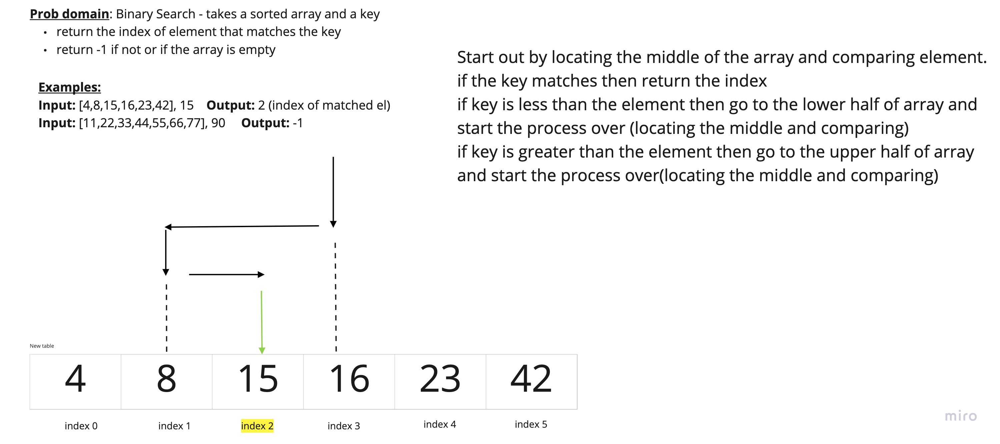

# Challenge Summary

- Code Challenge: Class 03 - Binary search in a sorted 1D array

## Challenge Description

- Write a function called BinarySearch which takes in 2 parameters: a sorted array and the search key. Without utilizing any of the built-in methods available to your language, return the index of the array’s element that is equal to the search key, or -1 if the element does not exist.
- NOTE: The search algorithm used in your function should be a binary search. Check the Resources section for details

## Approach & Efficiency

- No methods allowed, so we are going to need to use variables, a while loop.

- Worst case performance *O*(log *n*)
- Best case performance *O*(1)
- Average performance *O*(log *n*)
- Worst case space complexity *O*(1)

## Links and Resources

- [Wikipedia - Binary Search](https://en.wikipedia.org/wiki/Binary_search_algorithm)
- [Link to my completed code](https://github.com/arpatterson31/data-structures-and-algorithms/blob/array-binary-search/javascript/Challenges/arrayBinarySearch/array-binary-search.js)
- [Link to my test for code challege](https://github.com/arpatterson31/data-structures-and-algorithms/blob/array-binary-search/javascript/Challenges/__tests__/array-binary-search.test.js)

## Solution

