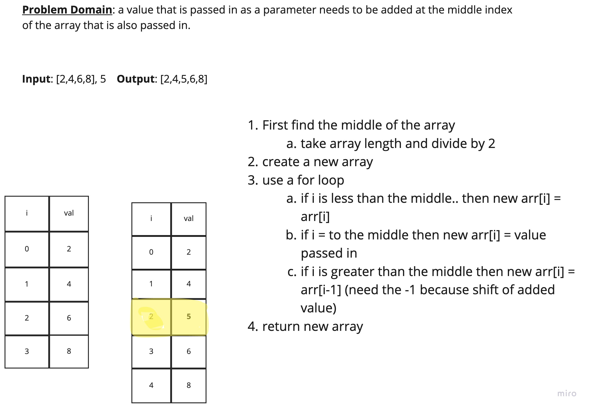

# Challenge Summary

- Code Challenge: Class 02 - Insert and shift an array in middle at index

## Challenge Description

- Write a function called `insertShiftArray` which takes in an array and the value to be added. Without utilizing any of the built-in methods available to your language, return an array with the new value added at the middle index.

## Approach & Efficiency

- First find the middle of the array
  - take array length and divide by 2
- create a new array
- use a for loop
  - if i is less than the middle.. then new array[i] = array[i]
  - if i = to the middle then new array[i] = value passed in
  - if i is greater than the middle then new array[i] = array[i-1] (need the -1 because shift of added value)
- return new array

## Solution

