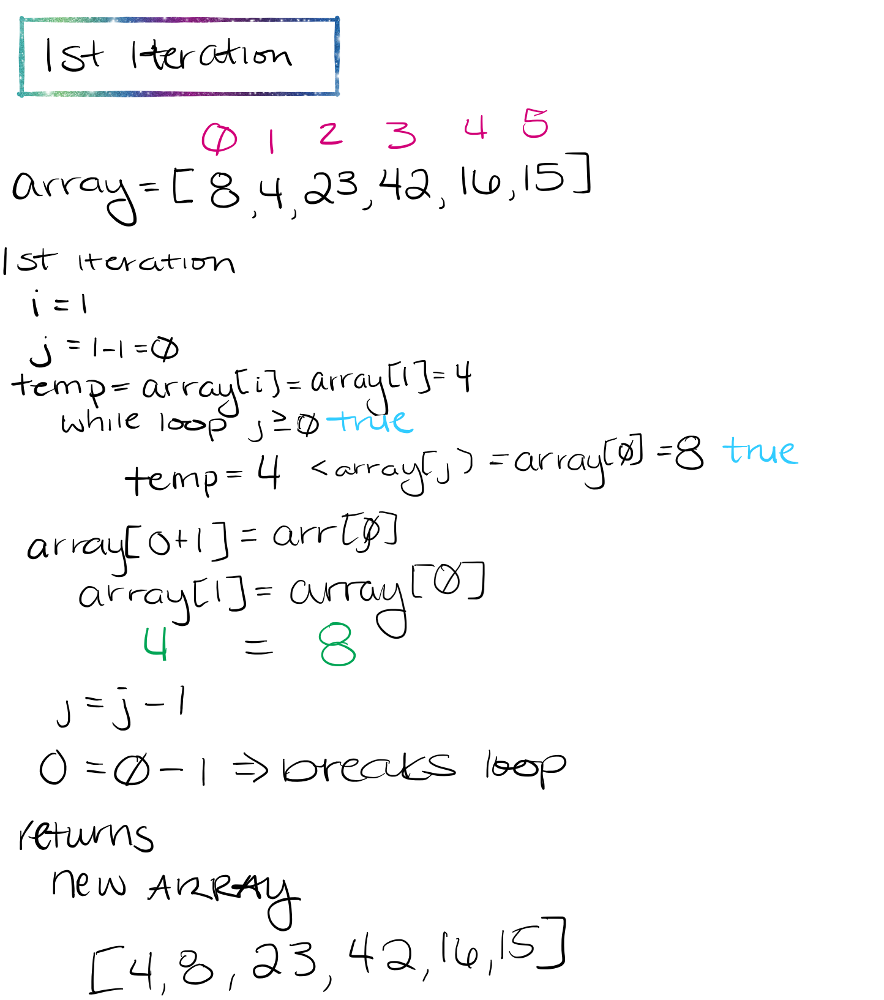

# Insertion Sort

Insertion Sort is a function that takes in an array of integers and returns an array with the values sorted in ascending order.

This function starts with a for loop uses a nested while loop. The for loop starts off with setting `i=1`, then having the counter set to `i < arr.length`. Once inside the for loop, you declare a variable of `j` and assign it a value of `i-1`. You will also need to assign a `temp` variable is set that to `arr[i]`.

Start the while loop. While `j` is greater or equal to 0(not a negative integer) and `temp` is less than `arr[j]` reassign the value of `arr[j]` to `arr[j + 1]`, and `j` will also be reassigned to `j-1`. The loop will run until the temp value is no longer less than the value of `arr[j]` or until `j` is less than 0.

You will then want to return the new `arr`.

## Output

Sample array:

````javascript
let arr = [8, 4, 23, 42, 16, 15]
````

## Visual Steps

- First Iteration


- Second Iteration
