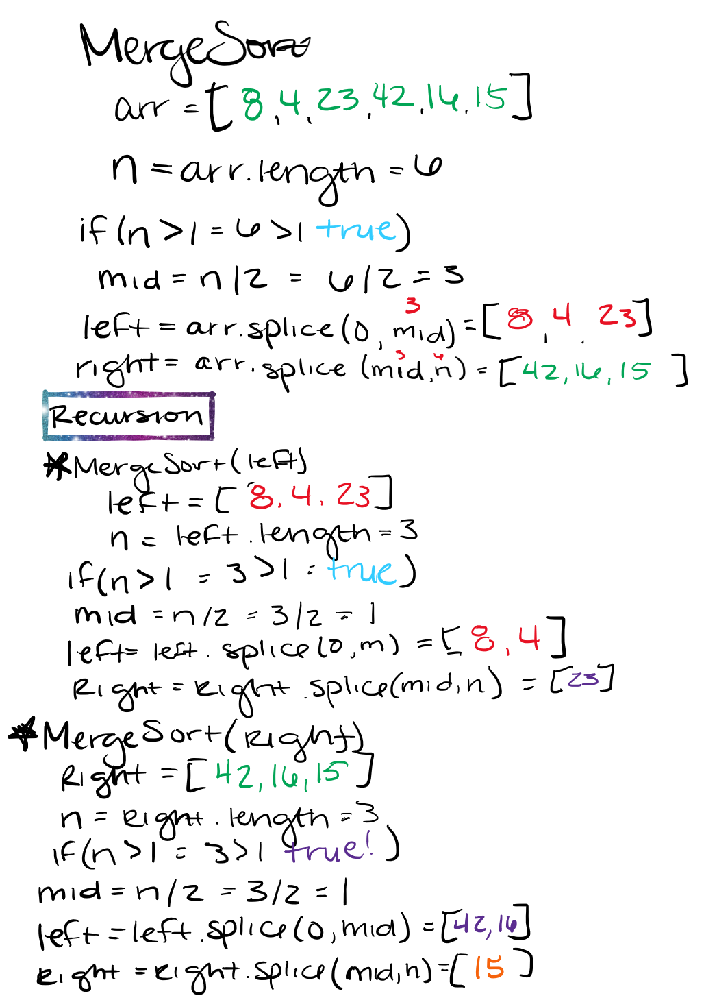
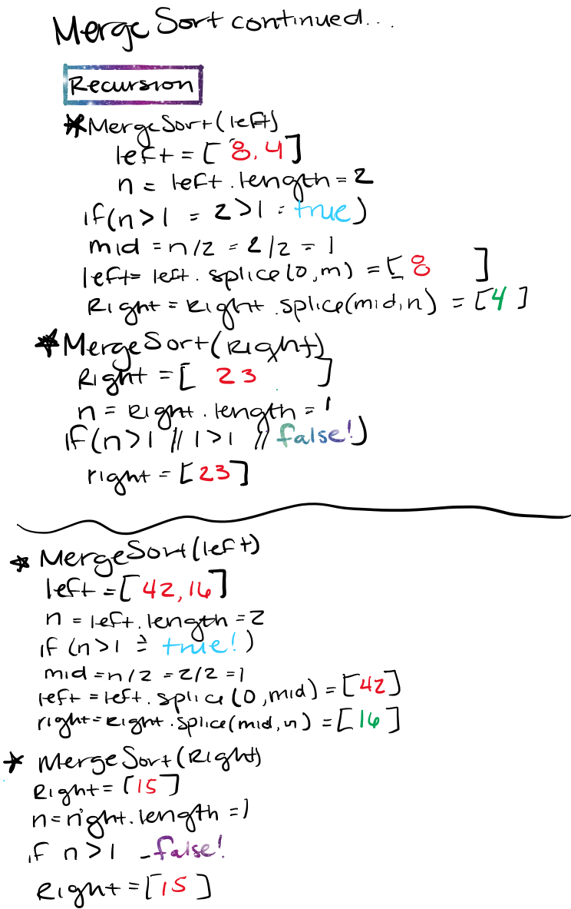
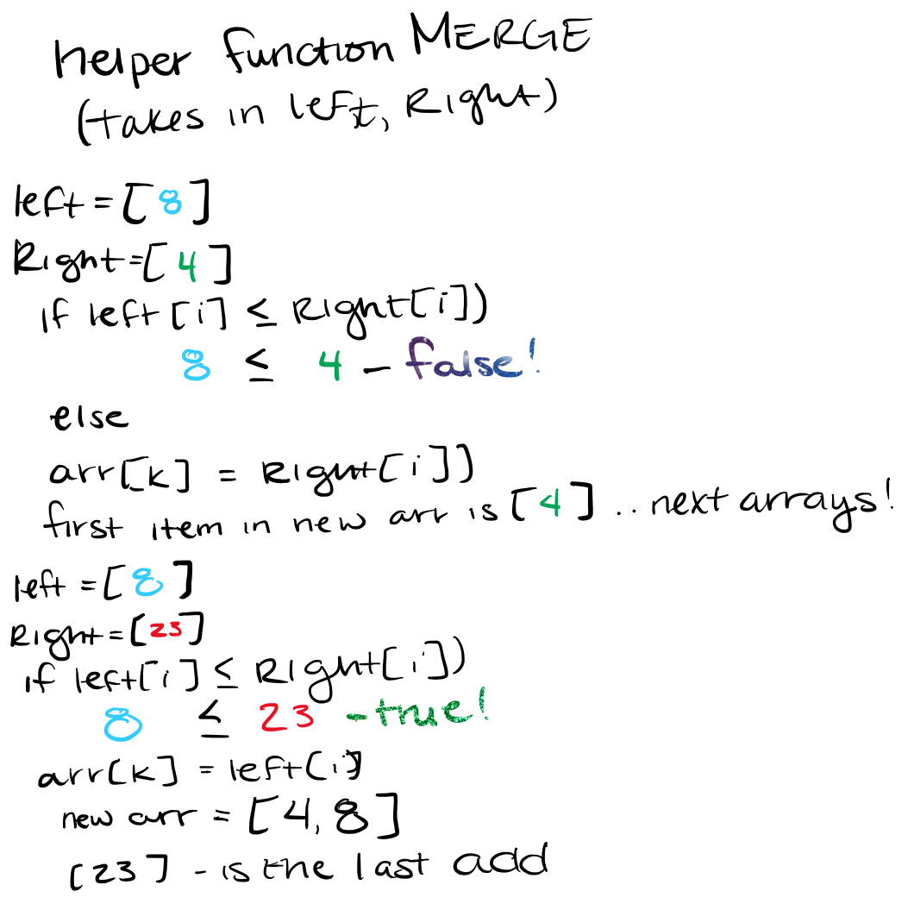
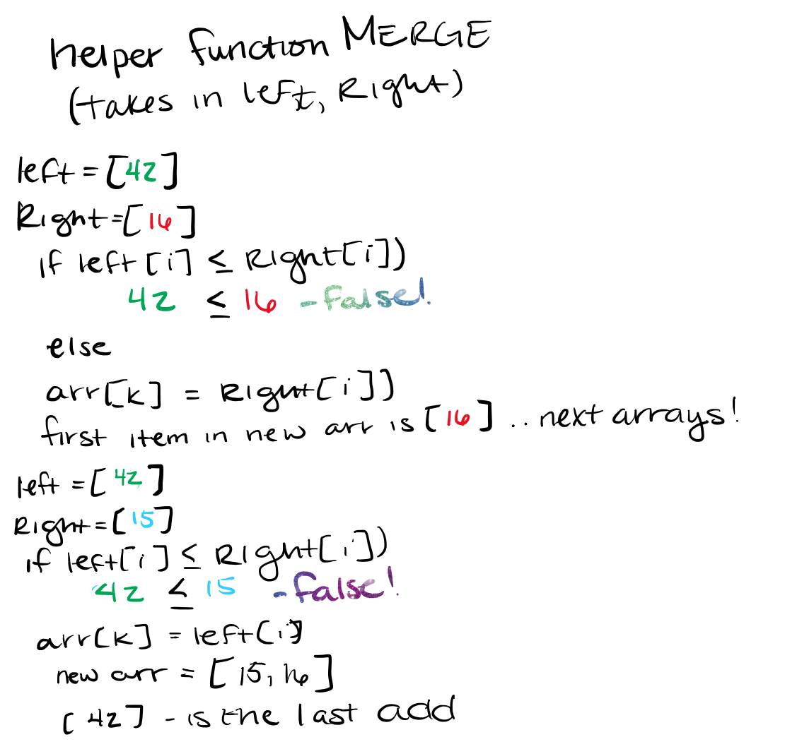
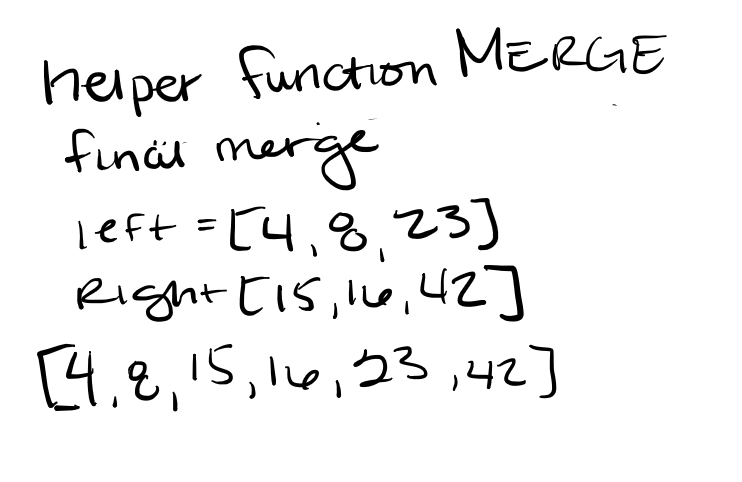

# Merge Sort

Merge sort is a function that takes in an array and uses the divide and conquer concept to sort the array. It breaks down the passed in array in half, then recursively breaks down those 2 halves, sorts them, and then merges everything back together.

## Pseudo Code

````javascript
ALGORITHM Mergesort(arr)
    DECLARE n <-- arr.length
           
    if n > 1
      DECLARE mid <-- n/2
      DECLARE left <-- arr[0...mid]
      DECLARE right <-- arr[mid...n]
      // sort the left side
      Mergesort(left)
      // sort the right side
      Mergesort(right)
      // merge the sorted left and right sides together
      Merge(left, right, arr)

ALGORITHM Merge(left, right, arr)
    DECLARE i <-- 0
    DECLARE j <-- 0
    DECLARE k <-- 0

    while i < left.length && j < right.length
        if left[i] <= right[j]
            arr[k] <-- left[i]
            i <-- i + 1
        else
            arr[k] <-- right[j]
            j <-- j + 1
            
        k <-- k + 1

    if i = left.length
       set remaining entries in arr to remaining values in right
    else
       set remaining entries in arr to remaining values in left
````

## Trace

### Sample Array

````javascript
let array = [8, 4, 23, 42, 16, 15]
````

## Visual Steps

- First Rescursion: Split the initial array in half and then half those subarray:



- Second Rescursion: Split those subarrays until they are arrays with one element



- Next step is to use the helper function `merge()` to sort then merge the single element arrays



- Then merge 2nd half of the original array



- Continue until all are merged into a single sorted array



## Link to Code

[Link to CODE](merge-sort.js)

## Link to tests

[link to tests](https://github.com/arpatterson31/data-structures-and-algorithms/blob/merge-sort/javascript/Data-Structures/__tests__/merge-sort.test.js)
