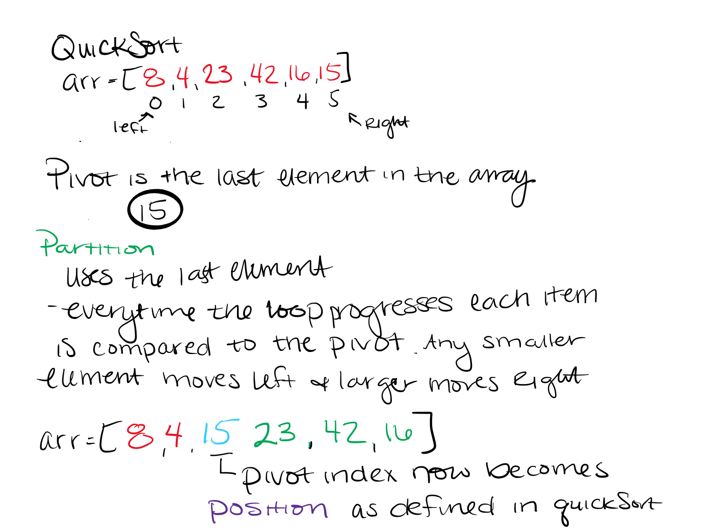
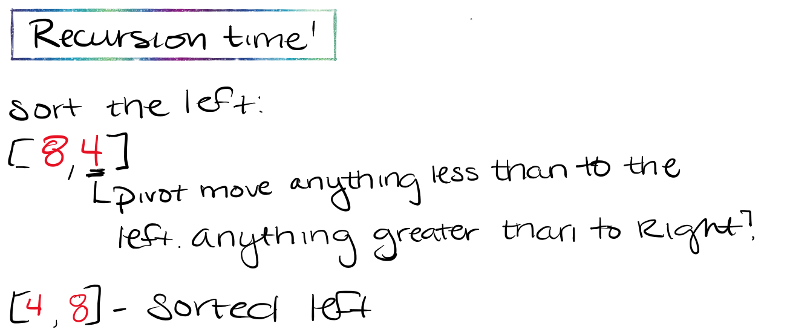
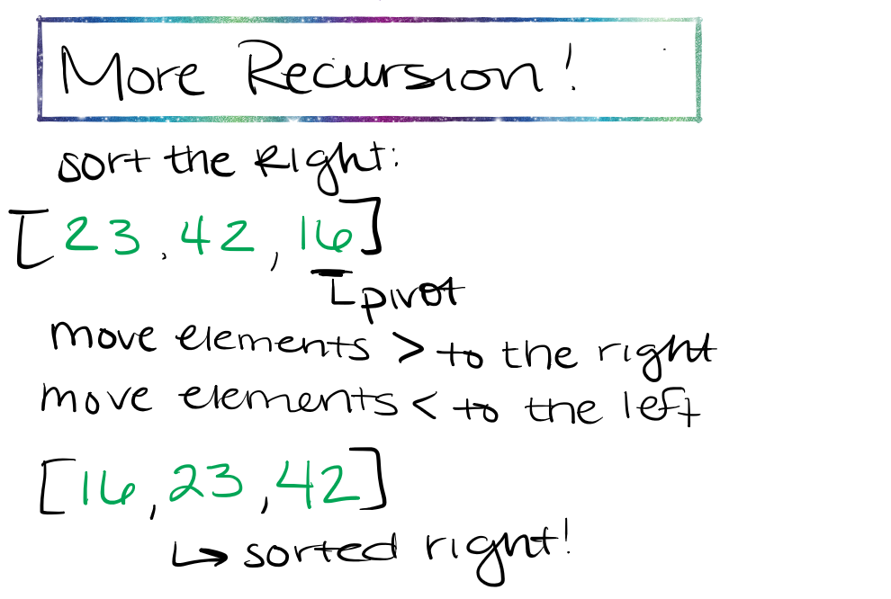
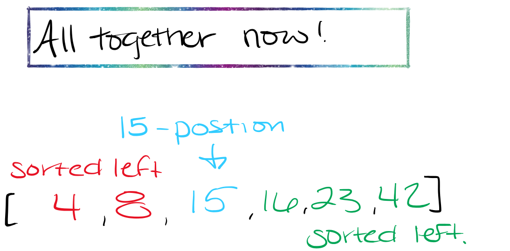

# Quick Sort

Like `mergeSort`, `quickSort` follows the divide and conquer approach. It divides the arrays into smaller parts based on a condition and performs the sort on those divided smaller parts. It uses a helper function `partition` to find the pivot that function uses another function called `swap` to swap the position of two values.

## Pseudocode

````javascript
ALGORITHM QuickSort(arr, left, right)
    if left < right
        // Partition the array by setting the position of the pivot value 
        DEFINE position <-- Partition(arr, left, right)
        // Sort the left
        QuickSort(arr, left, position - 1)
        // Sort the right
        QuickSort(arr, position + 1, right)

ALGORITHM Partition(arr, left, right)
    // set a pivot value as a point of reference
    DEFINE pivot <-- arr[right]
    // create a variable to track the largest index of numbers lower than the defined pivot
    DEFINE low <-- left - 1
    for i <- left to right do
        if arr[i] <= pivot
            low++
            Swap(arr, i, low)

     // place the value of the pivot location in the middle.
     // all numbers smaller than the pivot are on the left, larger on the right. 
     Swap(arr, right, low + 1)
    // return the pivot index point
     return low + 1

ALGORITHM Swap(arr, i, low)
    DEFINE temp;
    temp <-- arr[i]
    arr[i] <-- arr[low]
    arr[low] <-- temp
````

## Trace

### Sample Array

````javascript
let array = [8, 4, 23, 42, 16, 15]
````

## Visual Steps

- Quick Sort starts out with taking in an array, a left or starting index, usually 0, and a right which is the last index in the array or array.length-1.  So as long at the array has more than one element, you'll enter into the if statement. The next step after that is to find the pivot using the helper function `partition`. Pivot is defined as arr[right] or the last element in the array. It then loops through and moves items less than to the left and ones greater than to the right:



- Time for recursion! Sorting the left:



- More recursion! Sorting the right:



- Bring it all together now at the position!



## Link to Code

[Link to CODE](quick-sort.js)

## Link to tests

[link to tests](https://github.com/arpatterson31/data-structures-and-algorithms/blob/quick-sort/javascript/Data-Structures/__tests__/quick-sort.test.js)