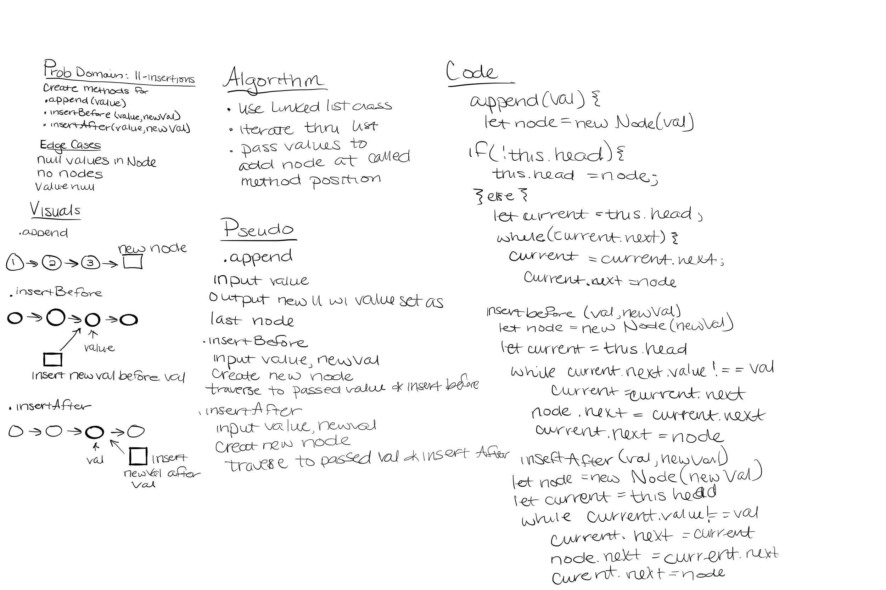
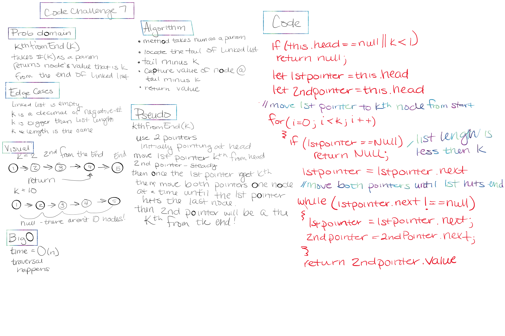

# Singly Linked List

- *Linked List* - A data structure that contains nodes that links/points to the next node in the list.
- *Singly* refers to the number of references the node has. A Singly linked list means that there is only one reference, and the reference points to the Next node in a linked list.

## Challenge

- Define a method called `insert` which takes any value as an argument and adds a new node with that value to the `head` of the list with an O(1) Time performance.
- Define a method called `includes` which takes any value as an argument and returns a boolean result depending on whether that value exists as a Node’s value somewhere within the list.
- Define a method called `toString` which takes in no arguments and returns a string representing all the values in the Linked List, formatted as:
`"{ a } -> { b } -> { c } -> NULL"`
- Define a method called `.append(value)` which adds a new node with the given value to the end of the list
- Define a method called `.insertBefore(value, newVal)` which add a new node with the given newValue immediately before the first value node
- Define a method called `.insertAfter(value, newVal)` which add a new node with the given newValue immediately after the first value node
- Define a method for the Linked List class which takes a number, `k`, as a parameter. Return the node’s value that is `k` from the end of the linked list. 

## Approach & Efficiency

- The Big O of time for `insert` would be O(1) because we replace the current `head` of the linked list with the new node.
- The Big O of time for `includes` would be O(n).
- The Big O of time for `toString` would be O(n) becasue we would need to traverse through the list to print out all the values.
- The Big O of time for `append` would O(n) because we have to traverse through the list to add the value at the end of the list
- The Big O of time for `insertBefore` would be O(n) because we need to traverse the list to add the new node immediately before the first value node
- The Big O of time for `insertAfter` would be O(n) because we are traversing to insert the node after the first value
- The Big O of time for `kthFromEnd` would be O(n) because we visted each node at least once.

## API

- `insert` will add a new node to the head of thie list
- `includes` will determine if the passed in value is in the linked list
- `toString` will print out the values in the linked list
- `append` will add a new node to the end of the list

## Links & Resources

- [Linked Lists for JavaScript Developers](https://daveceddia.com/linked-lists-javascript/)
- [Implmenting a Linked List in JavaScript](https://javascript.plainenglish.io/implementing-a-linked-list-in-javascript-3f71c83487b5)
- [Newbie's Guide to Visualizing a linked list in JavaScript](https://medium.com/swlh/newbies-guide-to-visualizing-a-linked-list-in-javascript-e8f94f130c48)
- [Video for kth from end](https://www.youtube.com/watch?v=NbKOw1bvRpM)

## Solution

- Whiteboard for LL Insertions

- Whiteboard for LL kthFromEnd

