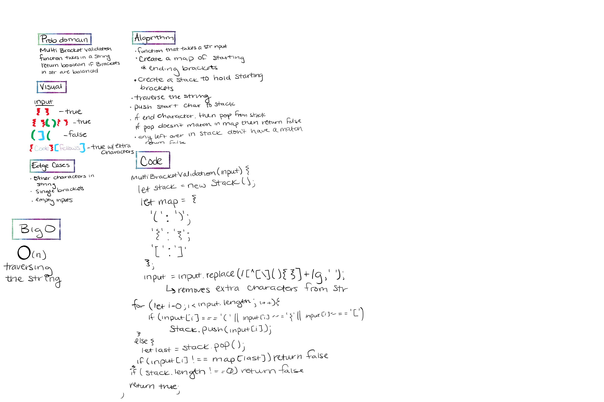

# Multi-Bracket Validation

## Challenge Description

- [Link to code](multi-bracket-validation.js)

- Create a function `multiBracketValidation(input)`

- Your function should take a string as its only argument, and should return a boolean representing whether or not the brackets in the string are balanced. There are 3 types of brackets:

- Round Brackets : `()`
- Square Brackets : `[]`
- Curly Brackets : `{}`

## Approach & Efficiency

- Big O - O(n) for traversing through the string input

## Solution

- Whiteboard for Queues with Stacks

## Links and Resources that helped me with this challenge

- [Solution using stacks](https://paulrohan.medium.com/parenthesis-matching-problem-in-javascript-the-hacking-school-hyd-7d7708278911)
