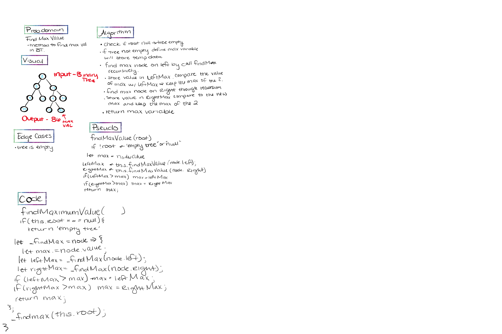

# Trees

- **Binary Tree** - no more than 2 child nodes
- **Binary Search Tree** - everything on the left is lower than the parent, everything to the right is great than the parent

## Challenge

### Binary Tree

- Define a method for each of the depth first traversals called `preOrder`, `inOrder`, and `postOrder` which returns an array of the values, ordered appropriately.

- Write an instance method called `find-maximum-value`. Without utilizing any of the built-in methods available to your language, return the maximum value stored in the tree. You can assume that the values stored in the Binary Tree will be numeric.

- Write a `breadth first` traversal method which takes a Binary Tree as its unique input. Without utilizing any of the built-in methods available to your language, traverse the input tree using a Breadth-first approach, and return a list of the values in the tree in the order they were encountered.

### Binary Search Tree

- Define a method named `add` that accepts a value, and adds a new node with that value in the correct location in the binary search tree.
- Define a method named `contains` that accepts a value, and returns a boolean indicating whether or not the value is in the tree at least once.

## Approach & Efficiency
<!-- What approach did you take? Why? What is the Big O space/time for this approach? -->

## API

### Binary Search Tree 

- `add` that accepts a value, and adds a new node with that value in the correct location in the binary search tree.
- `contains` that accepts a value, and returns a boolean indicating whether or not the value is in the tree at least once.

### Binary Tree

- `preOrder` traversal D, L, R
- `inOrder` traversal L, D, R
- `postOrder` traversal L, R, D
- `find-maximum-value` - return the max value stored in the tree
- `breadthFirst` - Breadth first traversal iterates through the tree by going through each level of the tree node-by-node

## Solution

- WB Solution for `findMaximumValue`

- WB Solution for `breadthFirst`

